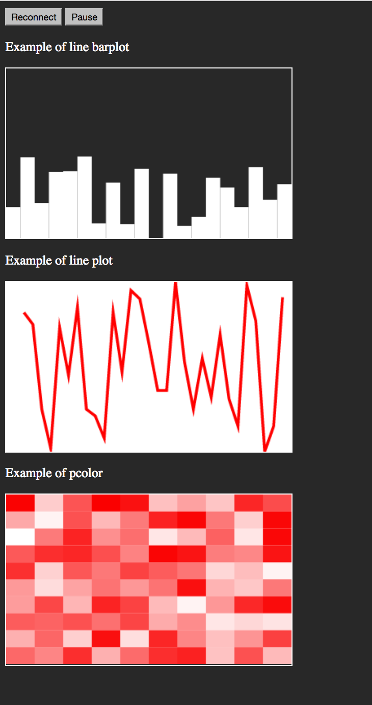

<h1>Fast_Plot_Python_in_the_Browser</h1>
<h3>fastplot</h3>

Fast and real-time plotting in Python is still far from being achieved.  
fastplot takes advantage of the rendering capabilities of modern web-browsers and Javascript to quickly update visualisations.   
Get the best of both worlds: Python to compute, JavaScript to render.  
As you can see this package its still in early stage.... please help :)  
Author: Diogo Santos-Pata, 2016  

<h1>How to install it: </h1>
<h4>Set server</h4>

<li>Open a terminal window </li>
<li>Go to ('cd') the <i>fastplot</i> directory you downloaded</li>
<li>Go to ('cd') the <i>fastplot_server</i> directory</li>
<li>Type: <it>sudo chmod 755 fastplot</it> </li>
<li>Open the .profile file by typing: nano .profile </li>
<li>At the end of the file paste: <i>export PATH="$your/path/folder/here/fastplot_server:$PATH" </i> (make sure to set the correct path)</li> 

<li>Save the .profile file, exit, and type <i> source .profile </i>  </li> 

Now you should be able to execute the 'fastplot' command everywhere in your machine and see the message:  
Running fastplot server...

<h4>Install fastplot python library</h4>

<li>Go back to ('cd') the <i>fastplot</i> directory you downloaded</li>
<li>Type: <i>sudo python setup.py install</i>  </li>
If all goes well, you should see something like:  
<i>
Installed /Library/Python/2.7/site-packages/fastplot-0.0.1-py2.7.egg  
Processing dependencies for fastplot==0.0.1  
Finished processing dependencies for fastplot==0.0.1  
</i>
:+1:

<h1>How to use it: </h1>

From your console type: 

<li> <i>python web_viz_udp.py </i> </li>   

That will setup a Tornado server to communicate between python and javascript.   

Next, open in your favourite browser:  

<li> <i> index.html </i> </li>   

Now, you are all set to let your python script perform its crazy computations and all you need to do to 
plot data is to call the <i>sender()</i> function.
To see it in action right away, try to run: <li> <i>main.py </i> </li> 

<h3>Dependencies:</h3>
<li>  <a href="http://www.tornadoweb.org/en/stable/"> Tornado</a>  </li>
<li>  <a href="https://docs.python.org/2/library/socket.html"> Socket</a>  </li>
